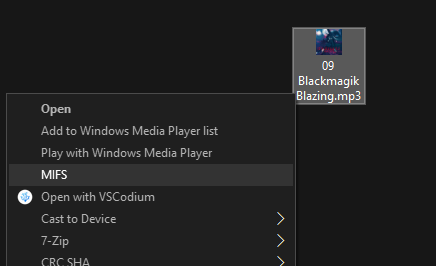
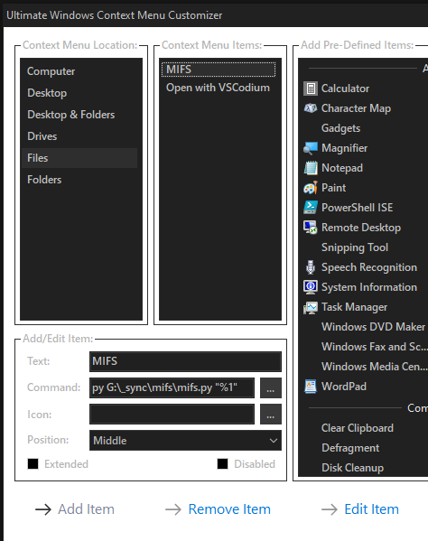

# MIFS - Make It Fucking Smaller
One click solution for sharing big files on the internet. 

Automatically calculates parameters (bitrate, resolution, fps, etc...) and encodes video/audio/image files to fit in specified target size (currently a constant `MAX_SIZE_DISCORD=1024*1024*8`). 

# Nerd shit

## Planned features
- Better support for videos (right now its not guaranteed that video will stay under the target size)
- API

## Manual Usage

### A. Install it in the context menu

#### Requirements
- 75 iq points
- Python 3.7+
- ffmpeg in PATH
- Optionally `py -3.7 -m pip install -r requirements.txt`
- [Ultimate Windows Context Menu Customizer](http://www.door2windows.com/ultimate-windows-context-menu-customizer-customize-context-menu-in-windows-xp-vista-7/)

`py G:\_sync\mifs\mifs.py "%1"`

### B. Use it like a retard (linux)
`py mifs.py ./path/to/file.ext`

#### P.S.

Don't pay furries $4.99/$9.99 a month.

If you were looking for hot miLfs and stumbled on this - you can find them [here](https://duckduckgo.com/?q=%21gi+hot+milfs).