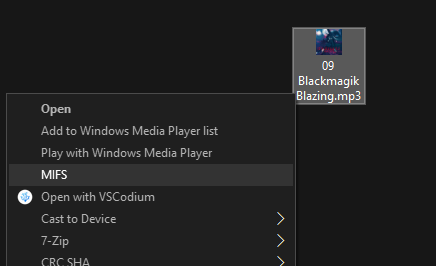

# MIFS - Make It Fucking Smaller

One click solution for sharing big files on the internet. 

Automatically calculates parameters (bitrate, resolution, fps, etc...) and encodes video/audio/image files to fit in specified target size (currently a constant `MAX_SIZE_DISCORD=1024*1024*8`). 

#### P.S.

Don't pay furries $4.99/$9.99 a month.

If you were looking for hot miLfs and stumbled on this - you can find them [here](https://duckduckgo.com/?q=%21gi+hot+milfs).