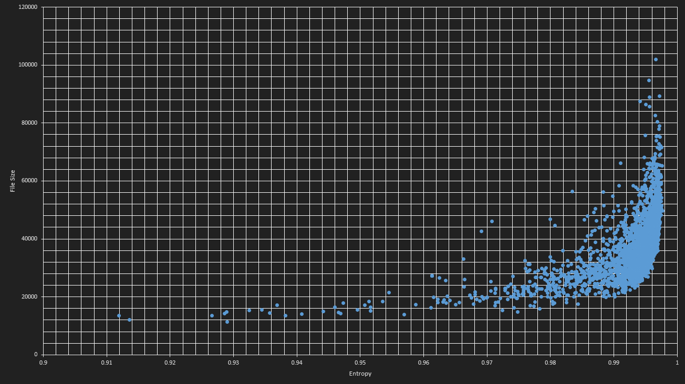
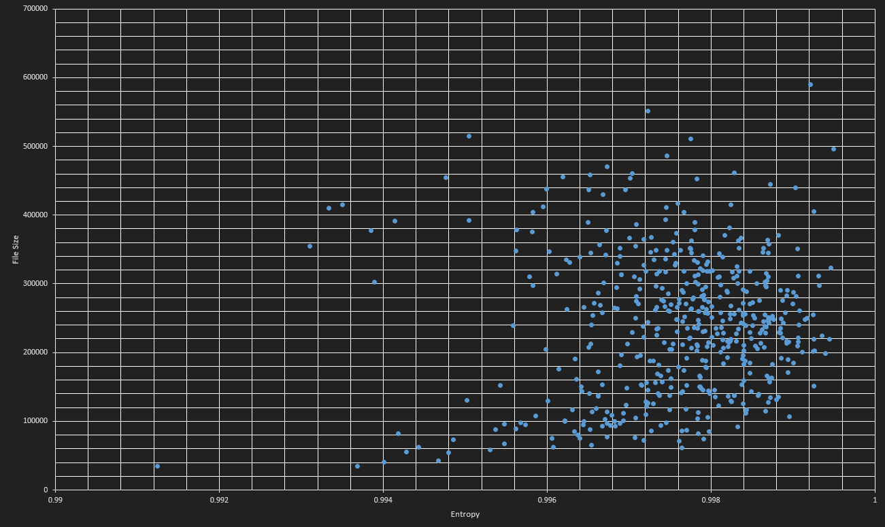

# Entropy to file size corelation

Idea is to use entropy of a file as an indicator of how complex the actual image is and create optimization function based on it.

All images were normalized to the same resolution (512x512) prior to analyzing them.

Calculated based on [normie reddit memes dataset](https://www.kaggle.com/sayangoswami/reddit-memes-dataset).

Entropy function is a slightly modified version of [https://stackoverflow.com/a/990646](https://stackoverflow.com/a/990646).

## JPG filesize/entropy

## PNG filesize/entropy

